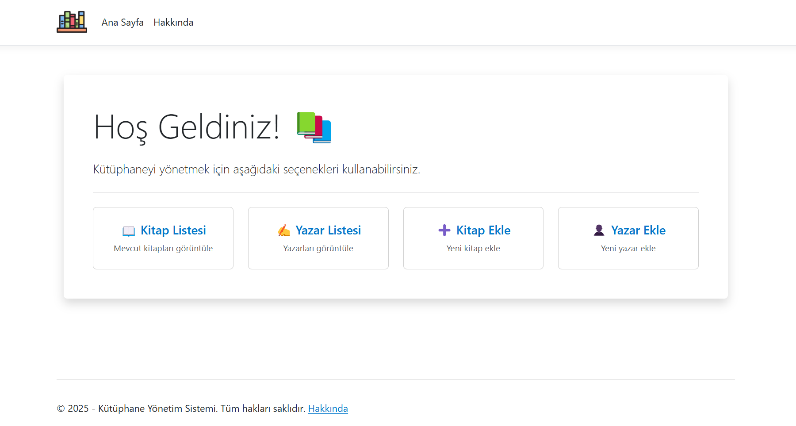

# Library Management System 📚

Hello! This is a simple web application for managing libraries. The project is developed with .NET 9, and the interface is built using HTML,
JavaScript, CSS, and Bootstrap.

## Hocam Bu Not Size:
Projeyi Replit'e yükledim. Canlı görmek istiyorsanız bana projeyi çalıştır diye mesaj atın 30 saniyemi almaz. Bu [Linke](xx) tıklayarak projemi canlı bir şekilde inceleyebilirsiniz. Teşekkürler.

## Features 🌟
- Add a new **Author**
- Add a new **Book**
- View **Author List**
- View **Book List**
- View, update, and delete **Book details**
- View, update, and delete **Author details**
- Users can view the **Privacy Policy**
- Simple and clean **Design**

## Installation 🛠️
- The project is created with VS Code.

1. Clone the repository:
   ```sh
   git clone https://https://github.com/melihcandemir/LibraryManagement.git
   ```
2. Navigate to the project directory:
   ```sh
   cd LibraryManagement
   ```
3. Restore the required dependencies using NuGet:
   ```sh
   dotnet restore
   ```
4. Run the application:
   ```sh
   dotnet run
   ```

## Usage 🚀
- **Add New Author**: Click the "Add Author" button to add a new author.
- **Add New Book**: Click the "Add Book" button to add a new book.
- **Book List**: Click the "Book List" button to view the book list.
- **Author List**: Click the "Author List" button to view the author list.
- **Other Actions**: You can **delete**, **edit**, and **view details** of **authors** and **books** from their respective lists.

## Folder Structure 🔍
The main folder structure of our project is as follows:

- **`/Controllers`**: Contains the application's controllers, such as `AuthorController.cs` and `BookController.cs`.
- **`/Views`**: Contains HTML files and Razor pages, such as `Create.cshtml`, `Privacy.cshtml`.
- **`/Models`**: Contains classes that define the application's data model, such as `BookAddViewModel.cs`.
- **`/wwwroot`**: Contains static files of the web application (CSS, JavaScript, images, etc.).
- **`/Program.cs`**: The entry point and main configuration file of the ASP.NET Core application.

## Screenshots 📸
1. Home Page:
---


## Contact 📧
For any questions or feedback, feel free to reach me at [melihcanndemir@gmail.com](mailto:melihcanndemir@gmail.com).

---

**Have fun!** 🎉